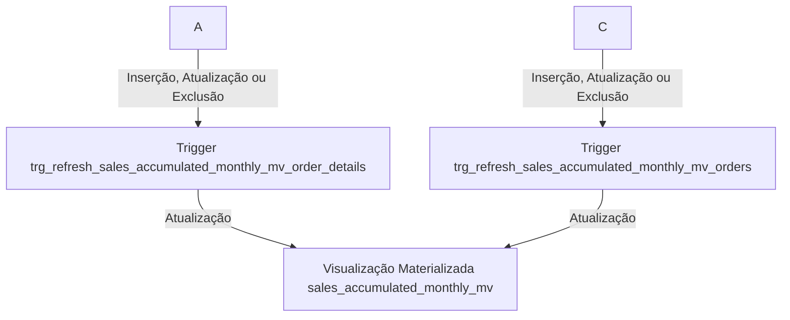

# ETL e BI com SQL — Northwind

## Objetivo

Este repositório tem como objetivo demonstrar conceitos de ETL e Business Intelligence diretamente em SQL usando o banco de dados Northwind.

Em vez de focar apenas em consultas analíticas, aqui o foco é mostrar como:
- Criar camadas analíticas usando Materialized Views;
- Usar Triggers para manter dados agregados e automatizar rotinas de negócio (ETL);

---

## Cenários de Negócio Atendidos

### 1. Vendas Mensais Acumuladas (Materialized View + Triggers)

**Pergunta de negócio:**  
> Como está o faturamento mensal da empresa e como isso pode ser acessado de forma rápida por relatórios e dashboards?

**Solução técnica:**
- Materialized View sales_accumulated_monthly_mv com o faturamento por ano/mês;
- Triggers nas tabelas orders e order_details que executam um REFRESH sempre que há qualquer mudança em uma dessas tabelas (INSERT, UPDATE, DELETE);
- Garante performance para consultas de vendas sem recalcular toda vez.

### 2. Auditoria de Título de Funcionários (Stored Procedure + Trigger)

**Pergunta de negócio:**  
> Como controlar e auditar mudanças de cargo dos funcionários ao longo do tempo?

**Solução técnica:**
- Tabela `audit.employees_title_audit` registrando cada alteração de título;
- Trigger em `employees` que insere um registro sempre que `title` é alterado;
- Stored Procedure `hr.update_employee_title` centralizando a atualização de título.

---

## Estrutura do Banco de Dados

O banco Northwind simula uma empresa de importação e exportação que realiza vendas de produtos alimentícios no atacado.  
É um banco de dados ERP com informações sobre clientes, pedidos, inventário, compras, fornecedores, remessas, funcionários e regiões.

Principais entidades:
- **Customers** – Clientes  
- **Orders / Order_Details** – Pedidos e itens do pedido  
- **Products / Categories / Suppliers** – Produtos, categorias e fornecedores  
- **Employees / Shippers** – Vendedores e transportadoras  
- **Regions / Territories** – Localização geográfica

Diagrama ER utilizado:

---