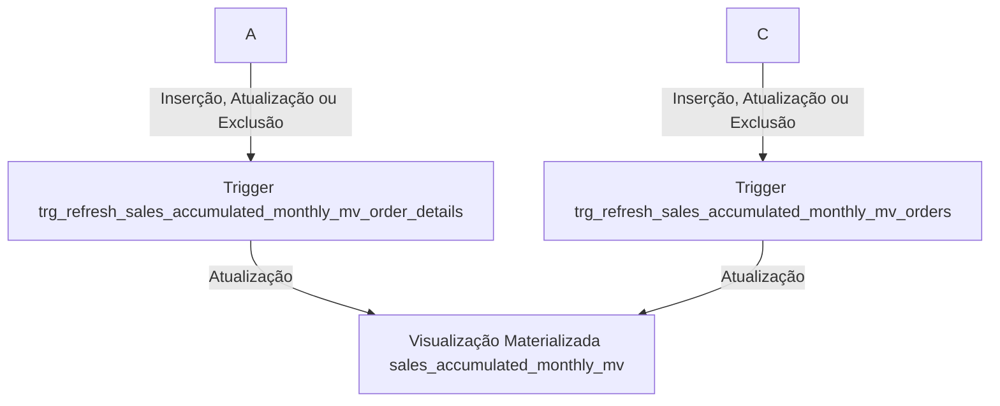
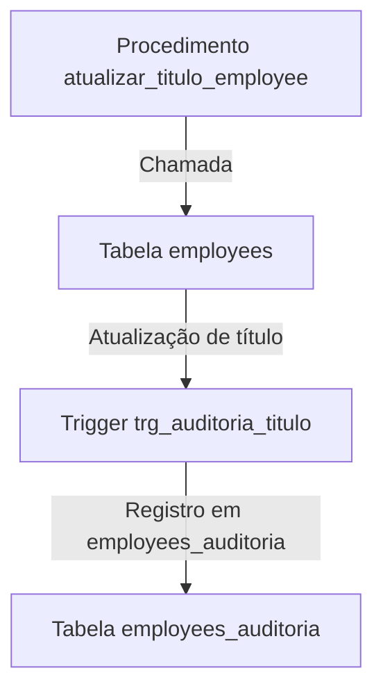

# ETL com SQL — Northwind

## Objetivo

Este repositório tem como objetivo demonstrar conceitos de ETL e Business Intelligence diretamente em SQL usando o banco de dados Northwind.

Em vez de focar apenas em consultas analíticas, aqui o foco é mostrar como:
- Criar camadas analíticas usando Materialized Views;
- Usar Triggers para manter dados agregados e automatizar rotinas de negócio (ETL);

---

## Cenários de Negócio Atendidos

### 1. Vendas Mensais Acumuladas (Materialized View + Triggers)

**Pergunta de negócio:**  
> Como está o faturamento mensal da empresa e como isso pode ser acessado de forma rápida por relatórios e dashboards?

**Solução técnica:**
- Foi criada uma materialized view sales_accumulated_monthly_mv com o faturamento por ano/mês;
```SQL
CREATE MATERIALIZED VIEW IF NOT EXISTS  sales_accumulated_monthly_mv AS 
SELECT 
	EXTRACT(year FROM o.order_date)::integer AS year_,
    EXTRACT(month FROM o.order_date)::integer AS month_,
    sum(od.unit_price * od.quantity::double precision * (1::double precision - od.discount))::numeric(12,2) AS receita
FROM order_details od INNER JOIN orders o ON o.order_id = od.order_id
  GROUP BY 1, 2
  ORDER BY 1, 2
```
- Triggers nas tabelas orders e order_details que executam um REFRESH sempre que há qualquer mudança em uma dessas tabelas (INSERT, UPDATE, DELETE);
```SQL
CREATE TRIGGER trg_orders_mv_refresh_sales_accumulated_monthly
AFTER INSERT OR UPDATE OR DELETE ON orders
FOR EACH STATEMENT
EXECUTE FUNCTION refresh_sales_acumulated_monthly_mv();
```
```SQL
CREATE TRIGGER trg_order_details_mv_refresh_sales_accumulated_monthly
AFTER INSERT OR UPDATE OR DELETE ON order_details 
FOR EACH STATEMENT 
EXECUTE FUNCTION refresh_sales_acumulated_monthly_mv();
```
- Garante que a sales_accumulated_monthly_mv esteja sempre atualizada

```SQL
CREATE OR REPLACE FUNCTION fn_refresh_sales_accumulated_monthly_mv()
RETURNS TRIGGER AS $$ 
BEGIN 
	REFRESH MATERIALIZED VIEW sales_accumulated_monthly_mv;
	RETURN NULL;
END;
$$ LANGUAGE plpgsql;
```


#### Fluxo de Atualização da sales_accumulated_monthly_mv


```mermaid
graph TD;
    B[Trigger trg_refresh_sales_accumulated_monthly_mv_order_details] -- Atualização --> E[Visualização Materializada sales_accumulated_monthly_mv];
    D[Trigger trg_refresh_sales_accumulated_monthly_mv_orders] -- Atualização --> E;
    A -- Inserção, Atualização ou Exclusão --> B;
    C -- Inserção, Atualização ou Exclusão --> D;
```

### 2. Auditoria de Título de Funcionários (Stored Procedure + Trigger)

**Pergunta de negócio:**  
> Como controlar e auditar mudanças de cargo dos funcionários ao longo do tempo?

**Solução técnica:**
- Tabela employees_auditoria registrando cada alteração de título;
```SQL
CREATE TABLE IF NOT EXISTS employees_auditoria(
	employee_id INT,
	nome_anterior VARCHAR(100),
	nome_novo VARCHAR(100),
	data_modificacao TIMESTAMP DEFAULT CURRENT_TIMESTAMP
); 
```
- Trigger em employees que insere um registro sempre que title é alterado;
```SQL
CREATE TRIGGER trg_auditoria_titulo
AFTER UPDATE OF title ON employees
FOR EACH ROW 
EXECUTE FUNCTION registrar_auditoria_titulo();
```
- Stored Procedure hr.update_employee_title centralizando a atualização de título.
```SQL
CREATE OR REPLACE PROCEDURE atualizar_titulo_employee(
    p_employee_id INT,
    p_new_title VARCHAR(100)
)
AS $$
BEGIN
    UPDATE employees
    SET title = p_new_title
    WHERE employee_id = p_employee_id;
END;
$$ LANGUAGE plpgsql;
```
#### Fluxo de Atualização da tabela employees_auditoria


```mermaid
graph TB;
    D[Procedimento atualizar_titulo_employee] -- Chamada --> A[Tabela employees];
    A -- Atualização de título --> B[Trigger trg_auditoria_titulo];
    B -- Registro em employees_auditoria --> C[Tabela employees_auditoria];
```
---

## Estrutura do Banco de Dados

O banco Northwind simula uma empresa de importação e exportação que realiza vendas de produtos alimentícios no atacado.  
É um banco de dados ERP com informações sobre clientes, pedidos, inventário, compras, fornecedores, remessas, funcionários e regiões.

Principais entidades:
- **Customers** – Clientes  
- **Orders / Order_Details** – Pedidos e itens do pedido  
- **Products / Categories / Suppliers** – Produtos, categorias e fornecedores  
- **Employees / Shippers** – Vendedores e transportadoras  
- **Regions / Territories** – Localização geográfica

Diagrama ER utilizado:


---